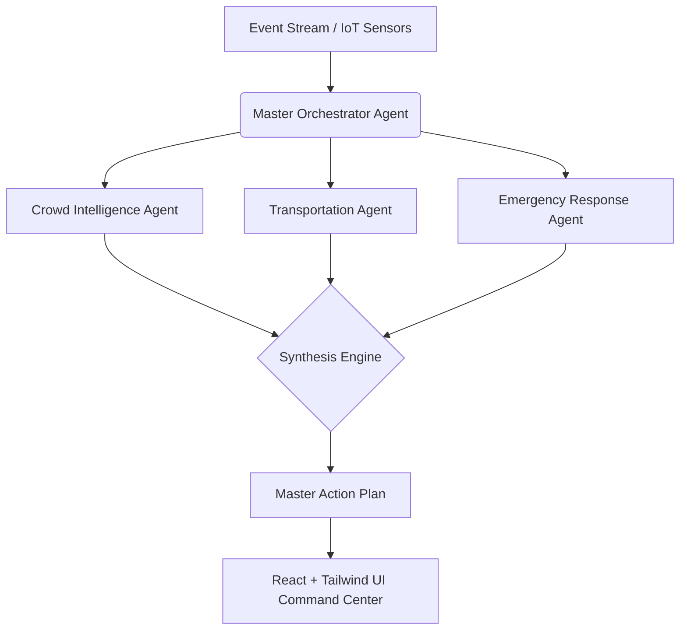

# StadiumMind AI

**FIFA World Cup 2026 Operational Intelligence Copilot**

## Problem Statement
Managing a global mega-event like the FIFA World Cup involves coordinating massive crowds, sprawling transportation networks, and critical emergency services in real-time. Traditional command centers rely on reactive dashboards and human operators trying to correlate thousands of disjointed data points. This often leads to delayed responses to bottlenecks, sub-optimal resource allocation, and compromised fan experiences.

## Why This Solution is Unique
StadiumMind AI moves beyond simple chatbots and reactive dashboards. It employs a **Proactive Multi-Agent Reasoning Architecture**. By ingesting a simulated stream of real-time stadium metrics, a Master Orchestrator delegates context to specialized AI agents (Crowd, Transport, Accessibility, etc.). These agents don't just report data—they *reason* over it, predicting issues before they occur and recommending prioritized, explainable operational actions.

## Architecture Diagram


## AI Agent Workflow
1. **Context Ingestion**: Real-time metrics (attendance, weather, shuttle schedules) are passed to the Master Orchestrator.
2. **Concurrent Delegation**: The orchestrator triggers specialized agents using `asyncio.gather`.
3. **Domain-Specific Reasoning**: Each agent assesses risks, correlates data, and generates structured observations using **Google Gemini 2.5**.
4. **Synthesis**: The Orchestrator resolves conflicts and generates a fully translated plan in the operator's native language.
5. **Execution UI**: The plan is presented to the human operator with an explainability panel.

## Folder Structure
```text
stadium_mind_ai/
├── frontend/                   # React + TypeScript + Vite SPA
│   ├── src/components/         # Dashboard UI
│   └── tailwind.config.js
├── src/
│   ├── domain/                 # Core Pydantic Models and Interfaces
│   ├── application/            # Orchestrator and Base Agent logic
│   ├── infrastructure/         # Google Gemini integration and Prompts
│   └── presentation/           # FastAPI application
├── vercel.json                 # Serverless routing configuration
└── README.md
```

## Deployment and Setup
The project is architected for **Vercel Serverless Deployment** utilizing a FastAPI backend and a Vite React frontend.

**Environment Variables Required in Vercel:**
- `LLM_API_KEY`: A valid Google Gemini API Key.

**Local Development (React Frontend):**
```bash
cd frontend
npm install
npm run dev
```

## Prompt Engineering & Generative AI Approach
We utilize the official `google-genai` SDK targeting the `gemini-2.5-flash` model.
- **Strict Structured Outputs**: To guarantee integration with our Clean Architecture, the schema is injected dynamically into the prompt alongside the `response_mime_type="application/json"` configuration to force strict adherence to the Pydantic models.
- **Multilingual Support**: The operator's language is passed from the UI and dynamically injected into the synthesis prompt, ensuring global scalability.

## Security Considerations
- **API Key Management**: LLM API keys are managed securely via `pydantic-settings` and `.env` files.
- **Data Anonymization**: The simulated event stream assumes all fan data (e.g., CCTV feeds) is anonymized at the edge device level before reaching the AI.
- **Human-in-the-Loop**: The AI makes *recommendations*, not autonomous actuations. Critical actions require human operator sign-off.

## Accessibility Considerations
- **Software Accessibility (WCAG)**: The React dashboard uses high-contrast colors, semantic HTML, and screen-reader-friendly UI patterns.
- **Physical Stadium Accessibility**: The dedicated `AccessibilityAgent` proactively monitors sensory room availability, wheelchair requests, and ADA compliance, ensuring an inclusive experience for all fans.

## Sustainability Considerations
- **Energy Optimization**: The `SustainabilityAgent` actively correlates crowd density with HVAC and lighting systems to recommend resource throttling in low-occupancy sectors.
- **Waste Management**: Predictive models alert janitorial staff before waste bins reach capacity, streamlining physical operations and reducing overflow.

## Testing
- **Unit Tests**: Domain models and orchestrator logic are isolated for unit testing.
- **Mock LLM Providers**: The `ILLMProvider` interface allows dependency injection of mock LLMs to test orchestration logic without incurring API costs.

## Assumptions
- The stadium is equipped with modern IoT infrastructure (smart turnstiles, CCTV crowd estimation, smart HVAC).
- Real-time transit feeds (city buses, trains) provide accessible APIs for data ingestion.

## Future Enhancements
- **WebSockets Integration**: Stream live events directly from the backend to the React Digital Twin in real-time.
- **Multi-modal Input**: Allow the AI to ingest audio transcripts from volunteer radios or images directly from security cameras.
- **Mobile App for Volunteers**: Send the synthesized action plans directly to the mobile devices of on-the-ground staff.

## License
MIT License. See `LICENSE` for details.
